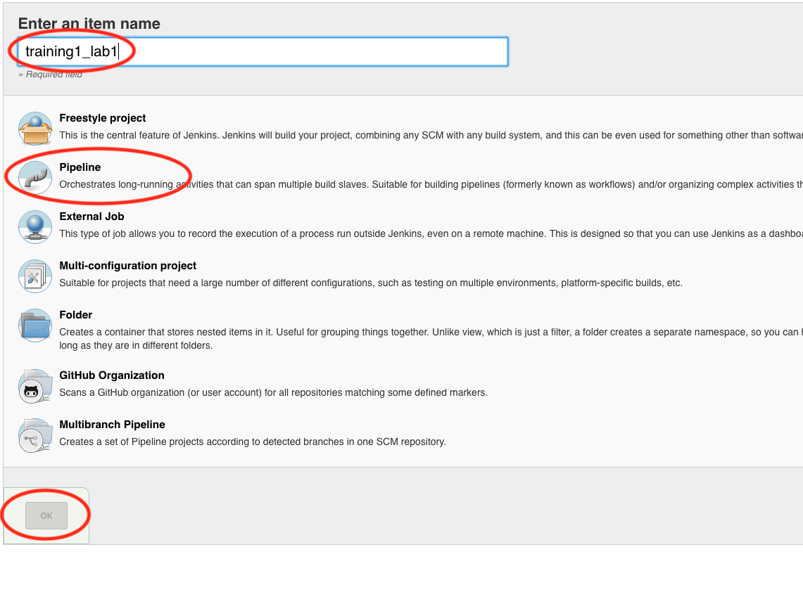
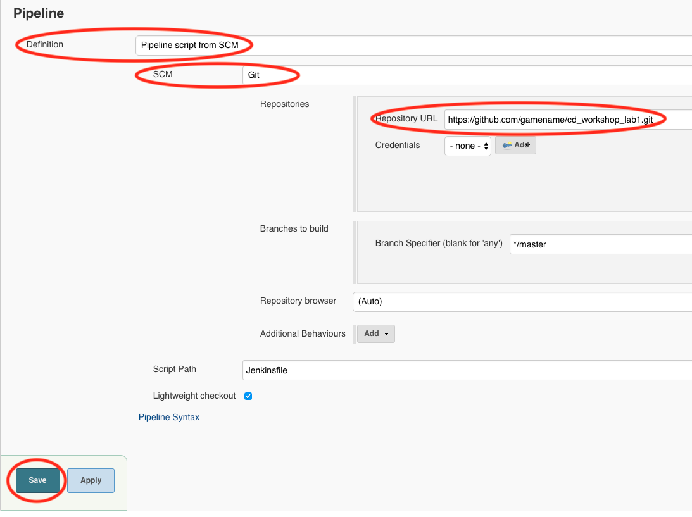
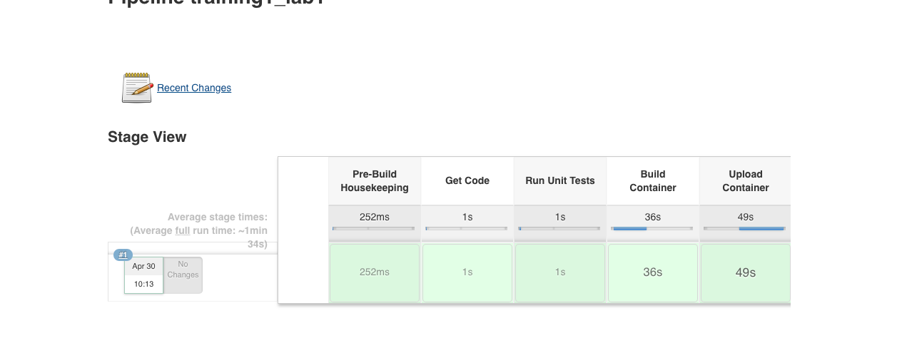

= Continuous Delivery: Lab 1
Tennis Smith <tennis@roundtower.com>
1.0
:toc:
:http://icons[icons][]: font
:quick-uri: http://www.roundtower.com

== Prerequisites
// tag::prerequisites[]
Students will need a computer with:

*	Web Browser (Chrome, Safari, Firefox)
// end::prerequisites[]

== Lab 1
// tag::procedure[]
=== Step 1: Login to GitHub
* In your workspaces session, open a web browser and login to github: http://github.com

TIP: If you don't have a GitHub account, go to http://github.com and create a free account

=== Step 2: Fork the lab1 repo
* Go to this url: https://github.com/RoundTower-io/cd_workshop_lab1

* Fork the repo by clicking on the "Fork" button in the upper right of the screen.

* This will create a copy of the lab1 repo under your own GitHub id

=== Step 3: Clone a copy of the lab1 repo
* In your workspace session, open a new terminal window by clicking on the Powershell icon.
image:common/adoc/images/open_powershell.png[]

* Make a local copy of the repo by cloning it with the following command

[source]
git clone https://github.com/<your user name>/cd_workshop_lab1.git

=== Step 4: Update the Jenkinsfile
* Go to the home directory of your new repo
[source]
cd cd_workshop_lab1

* Now edit the file `Jenkinsfile`
[source]
atom Jenkinsfile

* Change every occurrence of `training99` to your training ID (assigned by the instructor).

* Save and exit the file

=== Step 5:  Commit Changes and Push to Central Repository

* First, change the working directory.

[source]
cd ~/cd_workshop_lab1

* Next, add all altered files to the change set.

[source]
git add .

* Next, commit the changes.

[source]
git commit -m "Updated Jenkinsfile"

* Last, push the change to GitHub.

[source]
git push

=== Step 6: Setup a Jenkins pipeline

* Login to Jenkins at http://jenkins.roundtower.io

* Login using your assigned training id (get it from your instructor).

* Click on the "New Item" option on the main menu

image:common/adoc/images/jenkins_new_item.png[]

* Name your new pipeline `<your training id>_lab1` and select `pipeline` as the type. Then click `ok` to save it.

* Next, click on the `Poll SCM` option (about halfway down the page) and enter 5 asterisks in the field. This will cause Jenkins to look at GitHub once per minute for changes.  If changes are found, then the pipeline will run.

image:common/adoc/images/set_1_min_timer.png[]

* At the bottom of the page, set the `Definition` field to `Pipeline script from SCM`, then set the `SCM` field to `Git`. Put your lab1 url in the `Repository URL` field. Finally, click on `Save` to save all your work.

* At this point, you should see your pipeline run automatically. If so, you will see output something like this

// end::procedure[]

//
//
//
//
//  RESOURCE SNIPS - NOTHING BELOW HERE WILL BE RENDERED
//
// [source]
// $ brew install asciidoc
//
// ====
// _This is an italicized admonition_
// ====
//
// TIP:  Don’t eat the yellow snow.
//
// WARNING:  Weasels are bitey.
//
// ====
// *This is something you _REALLY_ should know*
// ====
//
