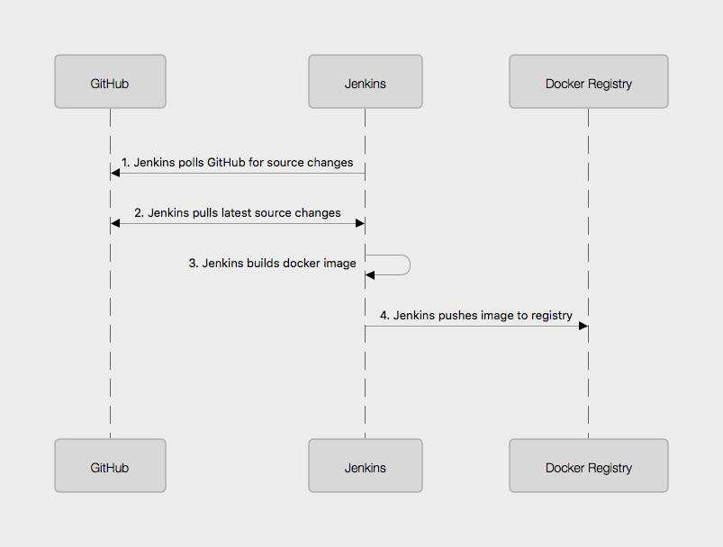
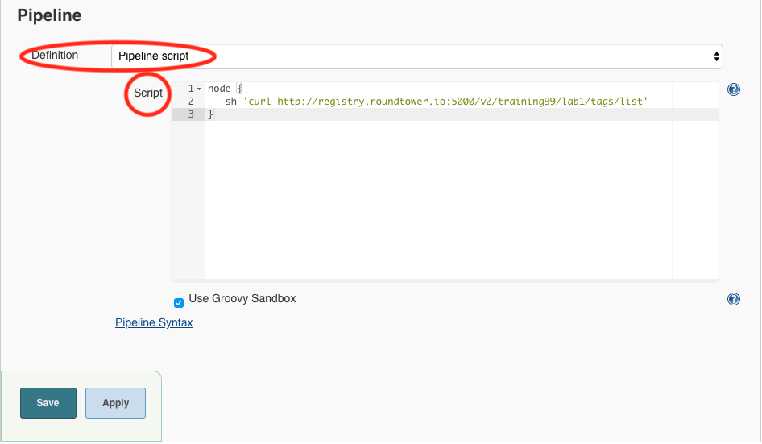
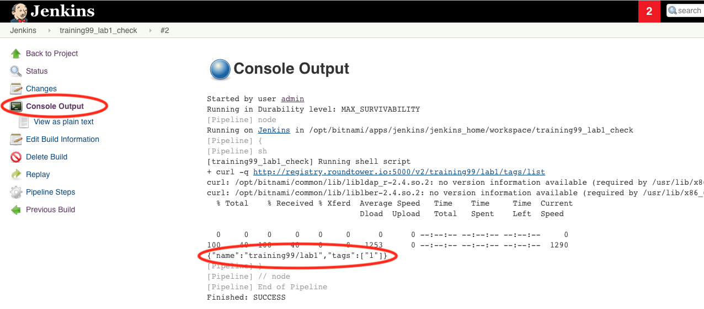

= Continuous Delivery: Lab 1
Tennis Smith
v1.1, 2019-07-12
:organization: RoundTower Technologies
:doctype: book
// Settings:
:experimental:
:reproducible:
:icons: font
:listing-caption: Listing
:toc:
:toclevels: 1
ifeval::["{asciidoctor-version}" < "1.5.7"]
:legacy-footnoteref:
endif::[]
ifdef::backend-pdf[]
:pdf-theme: common
:pdf-themesdir: {docdir}
:title-logo-image: image:common/adoc/images/roundtower.png[pdfwidth=4.25in,align=center]
:source-highlighter: rouge
endif::[]


== Prerequisites
// tag::prerequisites[]
Students will need a computer with:

* An Amazon Workspaces login (see your instructor for details)

// end::prerequisites[]

== Lab 1
// tag::procedure[]

Lab 1 will cause a new docker image to be built.  Jenkins will poll GitHub
(1 below). If there has been a source update (or if someone manually builds the pipeline), then
Jenkins will pull the latest source (2 below) and build the image (3 below).  Once
built, the image is then pushed to the docker registry (4 below).




=== Step 1: Login to GitHub
* In your workspaces session, open a web browser and login to github: http://github.com

TIP: If you don't have a GitHub account, go to http://github.com and create a free account

=== Step 2: Fork the lab1 repo
* Go to this url: https://github.com/RoundTower-io/cd_workshop_lab1

* Fork the repo by clicking on the "Fork" button in the upper right of the screen.

* This will create a copy of the lab1 repo under your own GitHub id

=== Step 3: Clone a copy of the lab1 repo
* In your workspace session, open a new terminal window by clicking on the Powershell icon.
image:common/adoc/images/open_powershell.png[]

* Make a local copy of the repo by cloning it with the following command

[source]
git clone https://github.com/<your user name>/cd_workshop_lab1.git lab1


=== Step 4: Update the Jenkinsfile
* Go to the home directory of your new repo
[source]
cd lab1

* Now edit the file `Jenkinsfile`
[source]
atom Jenkinsfile

* Change every occurrence of `training99` to your training ID (assigned by the instructor).

* Save and exit the file

=== Step 5:  Commit Changes and Push to Central Repository

* First, change the working directory.

[source]
cd ~/lab1

* Next, add all altered files to the change set.

[source]
git add .

* Next, commit the changes.

[source]
git commit -m "Updated Jenkinsfile"

* Last, push the change to GitHub.

[source]
git push

=== Step 6: Setup a Jenkins pipeline

* Login to Jenkins at http://jenkins.roundtower.io

* Login using your assigned training id (get it from your instructor).

* Click on the "New Item" option on the main menu

image:common/adoc/images/jenkins_new_item.png[]

* Name your new pipeline `<your training id>_lab1` and select `pipeline` as the type. Then click `ok` to save it.

image:common/adoc/images/new_pipeline.png[]

* Next, click on the `Poll SCM` option (about halfway down the page) and enter 5 asterisks (with 1 space between each) in the field. This will cause Jenkins to look at GitHub once per minute for changes.  If changes are found, then the pipeline will run.

image:common/adoc/images/set_1_min_timer.png[]

* At the bottom of the page, set the `Definition` field to `Pipeline script from SCM`, then set the `SCM` field to `Git`. Put your lab1 url in the `Repository URL` field. Finally, click on `Save` to save all your work.

image:common/adoc/images/set_pipeline_options.png[]

* At this point, you should see your pipeline run automatically. If not, click on `Build Now` on the upper left of the screen.

* After the build, click on your `trainingX_lab1` link on the dashboard. You should see output something like this:

image:common/adoc/images/pipeline_run_output.png[]

=== Step 7: Verify your docker image uploaded to the registry

* Create a new pipeline by clicking on `New Item` on the Dashboard

TIP | You can always get to the Dashboard by clicking on the word `Jenkins` in the upper left of the web page

* Name your new pipeline `trainingX_lab1_check` (where 'X' is your training ID number)

* Select `Pipeline` option.

* Click `OK`

* Scroll to the bottom of the next screen until you get to the `Pipeline` section

* Leave the `Definition` field set to `Pipeline script`

* Paste (or write) the following in the `Script` field

[source]
node {
   sh 'curl http://registry.roundtower.io:5000/v2/training99/lab1/tags/list'
}

* Be sure to change `training99` to your training ID


* Click the `Save` button to exit

* Click on the `Build Now` button on the left.

* Once the build completes, click on the build number in the `Build History` on the lower left of the screen.
image:common/adoc/images/get_build_history.png[]

* Click on the `Console Output` on the left of the screen


* You should see in the output provided something like the following with your training ID in it.
```
Started by user admin
Running in Durability level: MAX_SURVIVABILITY
[Pipeline] node
Running on Jenkins in /opt/bitnami/apps/jenkins/jenkins_home/workspace/training99_lab1_check
[Pipeline] sh
[training99_lab1_check] Running shell script
...
{"name":"training99/lab1","tags":["1"]}
...
Finished: SUCCESS
```

* The line `{"name":"training99/lab1","tags":["1"]}` means that version 1 of training99/lab1 is in the registry.  This verifies your docker image uploaded properly.


// end::procedure[]

